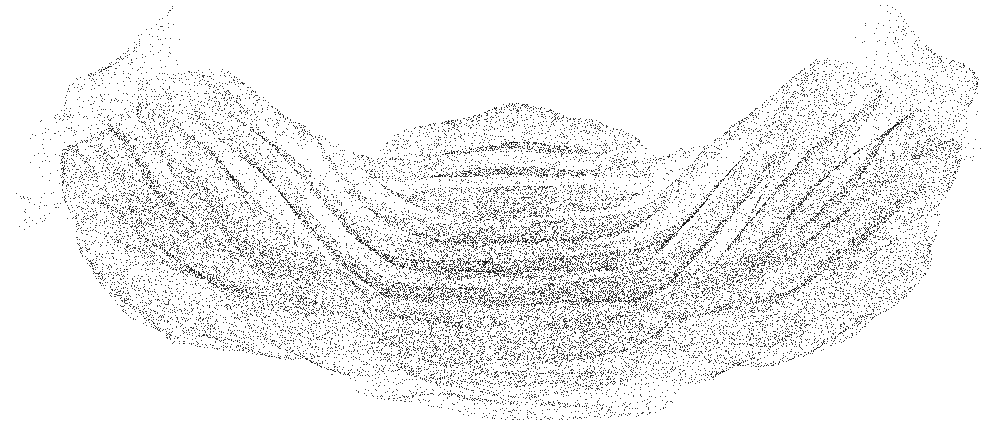

.. data_:

Data and results
================

Dataset
-------

Our software has been extensively tested on a whole cerebellum image
of a 10-days old L7-GFP mouse. In this transgenic animal, all Purkinje
cells express EGFP, allowing visualization and mapping of this
neuronal population.  The data set is large (120GVoxels, 28GBytes
lossless compressed TIFF).  If you are interested in this image and
its annotations for research purposes, you can request a copy by
sending email to XXX explaining your planned use.

Results of analysis
-------------------

A `VTK <http://www.vtk.org/VTK/img/file-formats.pdf>`_ file containing
3D coordinates of the whole cerebellum is :download:`available here
<_static/Cloud-xyz-d-sid.vtk.bz2>`.  The VTK file can be visualized with
programs such as `Cloud compare <http://www.danielgm.net/cc/>`_ or
`Paraview <http://paraview.org>`_. Besides XYZ coordinates, it
contains two scalars: *distance* is the estimated manifold distance,
*SID* is the substack ID. A preview of the point cloud is shown below.

