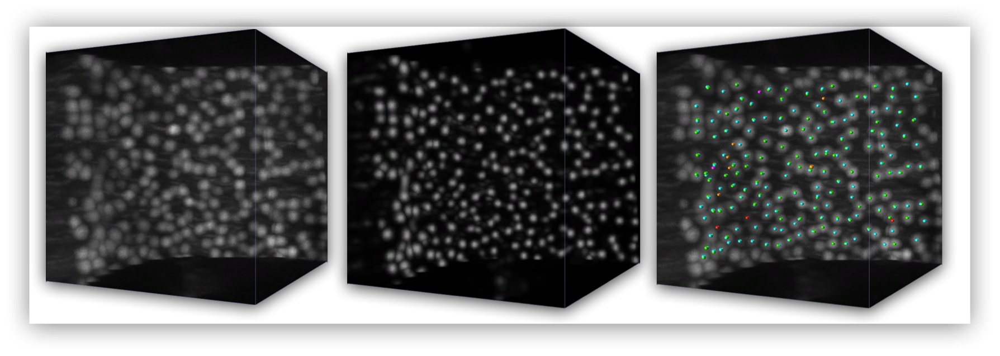

.. Brain cell finder documentation master file, created by
   sphinx-quickstart on Sat Mar 29 23:07:29 2014.
   You can adapt this file completely to your liking, but it should at least
   contain the root `toctree` directive.

Welcome
=======

Brain cell finder is a tool for fully automated localization of soma
in 3D mouse brain images acquired by confocal light sheet microscopy.
Given a 3D image as shown on the left, it first applies *semantic
deconvolution* to enhance somata and reduce dendritic trees and axon
bundles (center image). It then applies mean shift to locate soma
centers (right image: red/orange are false positives, magenta false
negatives). Furthermore, in the case of Purkinje soma in cerebellum
images, it estimates manifold distances to filter false positives
(orange points).

Images for this research were produced by the `Biophisics lab
<http://www.lens.unifi.it/index.php?include=research/dynamic_research&researcharea=Biophysics&active=research&menu=research/biophysics/biophysics_menu>`_
of `LENS <http://www.lens.unifi.it/>`_. The software was developed by
the `AI Lab <http://ai.dinfo.unifi.it/>`_ of `DINFO, Università di
Firenze <http://dinfo.unifi.it>`_ in collaboration with `Università
Campus Biomedico di Roma <http://www.unicampus.it/>`_.

.. toctree::
   :maxdepth: 1

   Download and install <installation>
   User guide <guide>
   Documentation of main scripts <scripts>
   Code internals (for developers) <internals>
   Paper and additional materials <additional>

Indices and tables
------------------

* :ref:`genindex`
* :ref:`modindex`
* :ref:`search`

